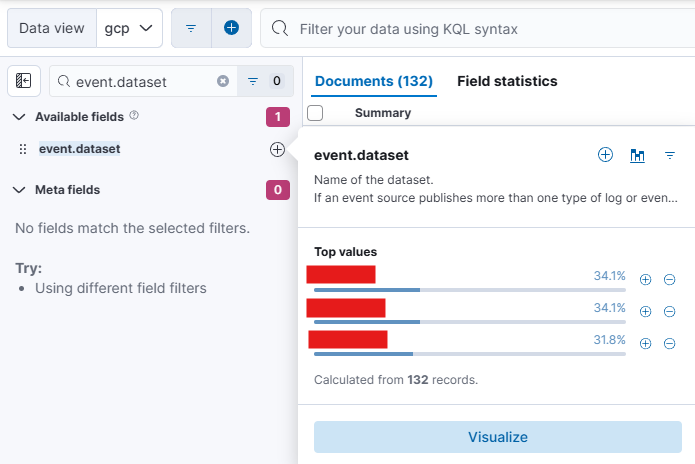
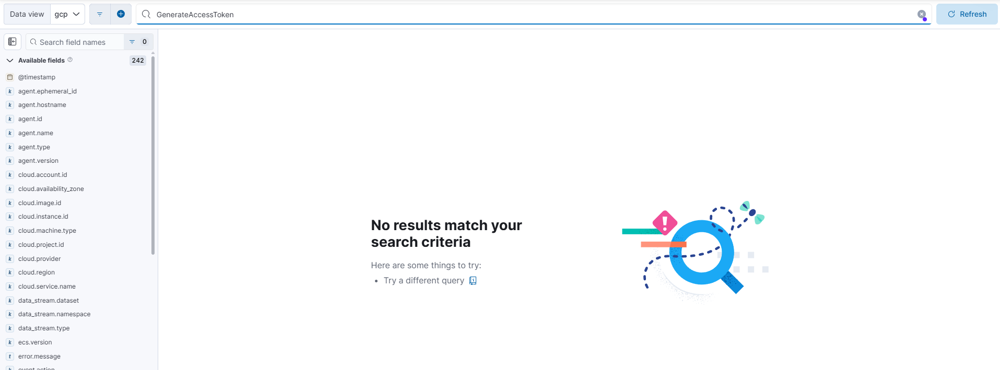
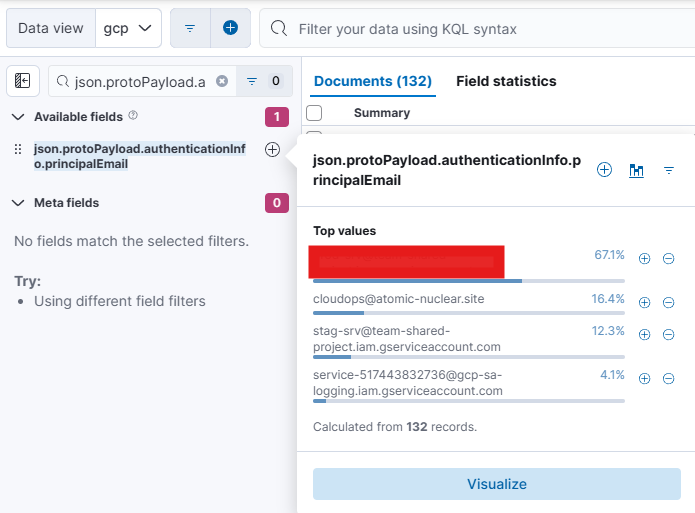
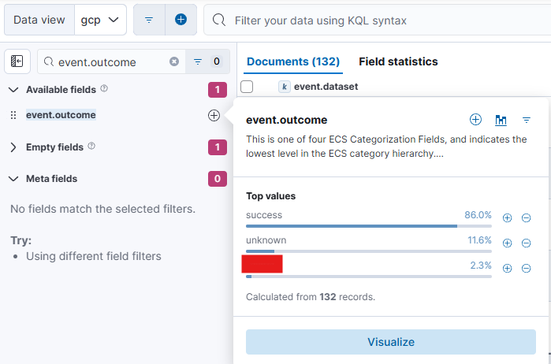
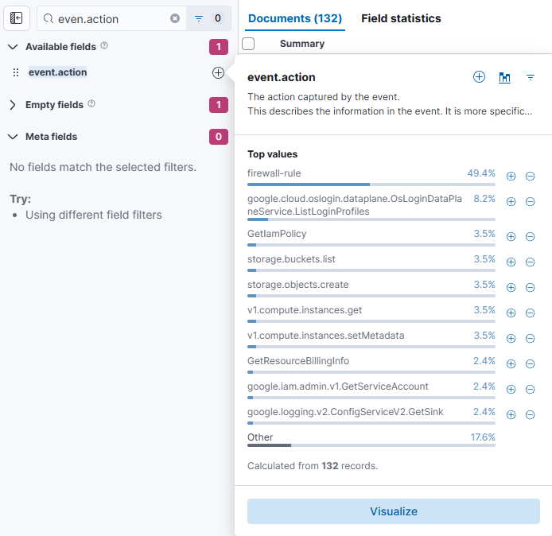
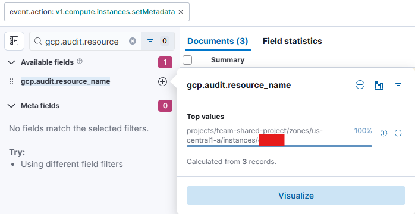
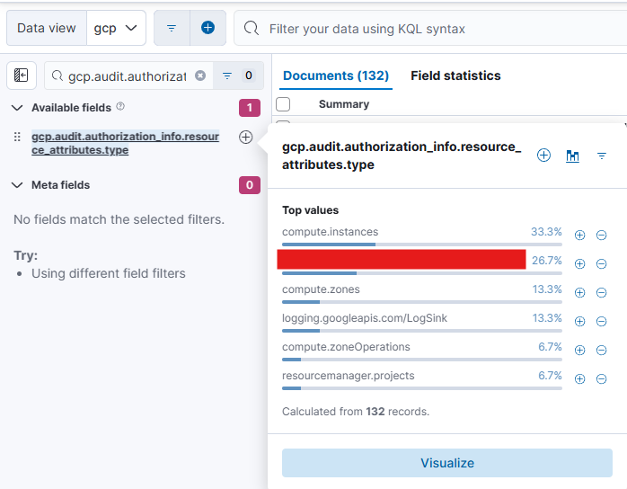
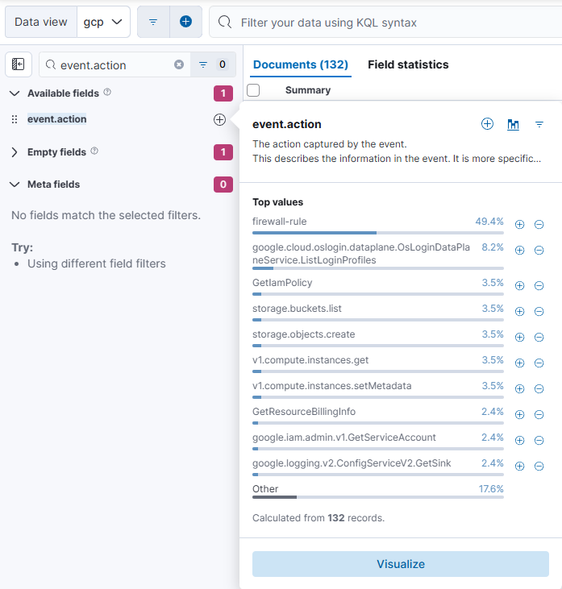
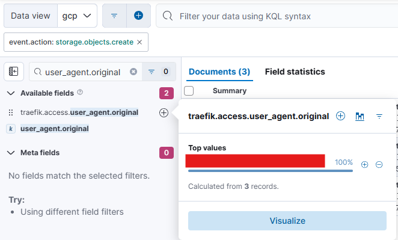
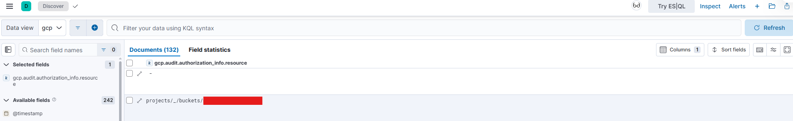

## 📘 MCBTA - GCP Investigation Report

**Analyst**: Renan - D3Z33  
**Course**: Multi-Cloud Blue Team Analyst (MCBTA)  
**Cloud**: Google Cloud Platform (GCP)  
**Standard References**: ISO/IEC 27001 • NIST CSF • CIS Controls • MITRE ATT&CK

---

### 🧪 Instructions

To become a certified **Multi-Cloud Blue Team Analyst**, the ultimate goal is to investigate various attack scenarios using the **SIEM: ELK Console**. The investigation involves analyzing multiple attacks targeting **AWS**, **Azure**, and **GCP** environments.

Successfully completing the module requires solving all three cloud-specific challenges outlined below:

- 🧩 All gamified, flag-based challenges come with unlimited attempts, allowing you to refine your investigation skills without restrictions.  
- ❌ There are no negative points for incorrect attempts, ensuring a risk-free learning experience.  
- ⏱️ Additionally, there are no time constraints, giving you the flexibility to analyze attack scenarios at your own pace and thoroughly investigate each challenge.

---

### 🔐 LAB ACCESS

- **USERNAME**: `***************`  
- **PASSWORD**: `***************`  
- **SIEM URL**: `****://*******************/*****`

> 🔍 Acesse e logue com suas credenciais.  
> 📂 Clique nas **três barras** ao lado superior esquerdo e vá para `Discover`.  
> ☁️ Escolha o **Data View** da prova que irá fazer, neste caso: `GCP`.

---

### ✅ Investigated Events (Q01–Q10)

> Todas as evidências foram coletadas via **Kibana** e analisadas conforme boas práticas de **análise forense em ambientes cloud**.

---

### 🔎 Q1 — Determine the GCP logs types which are integrated with SIEM

**Hint**: Prioritize the `event.dataset` fields to identify the logs integrated over the GCP service.

#### 🧠 Análise
O objetivo dessa questão é entender quais tipos de logs estão devidamente integrados ao SIEM, fornecendo visibilidade sobre as atividades na nuvem GCP.

#### 🔍 Procedimento realizado:

1. Acessamos o SIEM via Kibana.
2. Selecionamos o Data View `GCP`.
3. Expandimos o campo `event.dataset` no painel esquerdo para identificar os conjuntos de dados disponíveis.
4. Foi possível visualizar claramente logs como `gcp.audit`, `gcp.firewall`, entre outros.

#### ✅ Resultado
A imagem abaixo mostra os tipos de logs integrados no ambiente GCP:

[](https://github.com/D3Z33/MCBTA-GCP/blob/main/img/q1.png)

> Ter visibilidade dos datasets disponíveis é essencial para uma análise forense eficiente e cobertura de segurança contínua na nuvem.

---

### 🔎 Q2 — Determine whether a service account impersonation activity has been performed

**Hint**: Investigate events related to `GenerateAccessToken` or `GenerateIdToken` to determine service account impersonation.

#### 🧠 Análise
Esta questão busca identificar possíveis ações de **impersonação de contas de serviço**, geralmente associadas ao uso de tokens de acesso.

#### 🔍 Procedimento realizado:

1. Utilizamos o campo de busca no Kibana para procurar por:
   ```
   event.action: "GenerateAccessToken" OR "GenerateIdToken"
   ```
2. Não foram localizados registros relevantes com esse tipo de ação.
3. Diversos filtros e revisões manuais foram realizados para garantir que o evento não estivesse mascarado.

#### ✅ Resultado
As imagens abaixo mostram a ausência de registros com os eventos esperados:

[  
[](https://github.com/D3Z33/MCBTA-GCP/blob/main/img/q2.2.png)

> A ausência de eventos de impersonação pode indicar um ambiente sem movimentação lateral ativa ou que os registros ainda não foram ingeridos no SIEM.

---

### 🔎 Q3 — Identify the user which is associated with the “CreateOauthClient” event action

**Hint**: Focus on events related to `CreateOauthClient` and identify the associated user.

#### 🧠 Análise
O objetivo é identificar qual usuário está por trás da criação de um novo OAuth Client — atividade que pode ser usada para movimentações não autorizadas ou persistência.

#### 🔍 Procedimento realizado:

1. Pesquisamos diretamente por `CreateOauthClient`, mas não houve retorno.
2. Em seguida, aplicamos o filtro por campo:
   ```
   json.protoPayload.authenticationInfo.principalEmail
   ```
3. O valor retornado foi o e-mail do usuário que executou a ação de criação.

#### ✅ Resultado
A imagem abaixo mostra o campo `principalEmail` vinculado ao evento:

[](https://github.com/D3Z33/MCBTA-GCP/blob/main/img/q3.png)

> A criação de clientes OAuth deve ser rigidamente controlada, pois pode representar backdoors em aplicações legítimas.

---

### 🔎 Q4 — Determine and retrieve the IP get associated with the “CreateOauthClientCredential” action

**Hint**: Hunt for Client IP associated with `CreateOauthClientCredential` operation.

#### 🧠 Análise
A criação de credenciais OAuth pode estar relacionada à tentativa de estabelecer persistência ou controle de aplicações. O objetivo aqui é identificar o IP associado à solicitação com sucesso dessa ação.

#### 🔍 Procedimento realizado:

1. Acessamos o SIEM no Kibana e selecionamos o Data View GCP.
2. No painel de filtros à esquerda, buscamos pelo campo:
   ```
   json.protoPayload.requestMetadata.callerIp
   ```
3. Foram retornados **6 IPs distintos**.
4. Ao analisar os registros detalhadamente, percebemos que **apenas um dos IPs** contém o campo vinculado a `OAuthClient`, indicando sucesso na ação.

#### ✅ Resultado
As imagens abaixo mostram os IPs envolvidos e o único que realmente realizou a operação:

[](https://github.com/D3Z33/MCBTA-GCP/blob/main/img/q4.1.png)
[](https://github.com/D3Z33/MCBTA-GCP/blob/main/img/q4.2.png)

> A identificação precisa do IP ajuda a compor a trilha de auditoria, podendo ser utilizada para bloquear origens ou associar a outras ações suspeitas.

---

### 🔎 Q5 — Determine the outcome which are associated with the “CreateRole” event

**Hint**: Identify the event outcome associated with `CreateRole` event.

#### 🧠 Análise
A criação de funções (roles) personalizadas pode ser usada para escalar privilégios ou camuflar acessos. Entender se a ação foi bem-sucedida é fundamental.

#### 🔍 Procedimento realizado:

1. Acessamos o Kibana e filtramos eventos com a ação:
   ```
   event.action: CreateRole
   ```
2. Navegamos até o campo:
   ```
   event.outcome
   ```
3. O valor obtido foi: `success`.

#### ✅ Resultado
A imagem a seguir confirma o sucesso da operação de criação da role:

[](https://github.com/D3Z33/MCBTA-GCP/blob/main/img/q5.png)

> Operações de `CreateRole` bem-sucedidas devem ser sempre auditadas, pois são potenciais portas para abuso de permissões.

---

### 🔎 Q6 — Which computer instance is linked to the execution of the "instances.setMetadata" action?

**Hint**: Focus on events related to `instances.setMetadata` and analyze `gcp.audit.resource_name` to identify the compute instance.

#### 🧠 Análise
O objetivo desta questão é descobrir qual instância de máquina virtual foi modificada via `setMetadata` — ação que pode ser usada para scripts maliciosos ou manipulação de inicializações.

#### 🔍 Procedimento realizado:

1. No Kibana, filtramos o campo:
   ```
   event.action: v1.compute.instances.setMetadata
   ```
2. Em seguida, no mesmo painel esquerdo, buscamos por:
   ```
   gcp.audit.resource_name
   ```
3. O campo retornado exibe o nome da instância que sofreu a alteração.

#### ✅ Resultado
A imagem a seguir mostra a instância impactada:

[](https://github.com/D3Z33/MCBTA-GCP/blob/main/img/img/q6.1.png)
[](https://github.com/D3Z33/MCBTA-GCP/blob/main/img/q6.2.png)

> A modificação de metadados pode permitir comandos automáticos na inicialização da VM. Monitorar esse tipo de ação é essencial para detectar implantações maliciosas.

---

### 🔎 Q7 — Identify the attributes type associated with sensitive secrets were exfiltrated

**Hint**: Determine the `gcp.audit.authorization_info.resource_attributes.type` associated with the `SecretManagerService.ListSecrets`.

#### 🧠 Análise
Essa questão visa identificar o tipo de recurso envolvido em uma possível exfiltração de segredos via `ListSecrets` — uma operação sensível e com potencial de vazamento de informações críticas.

#### 🔍 Procedimento realizado:

1. No painel lateral esquerdo do Kibana, buscamos pelo campo:
   ```
   gcp.audit.authorization_info.resource_attributes.type
   ```
2. O campo retornou o tipo de recurso associado à tentativa de exfiltração.

#### ✅ Resultado
A imagem abaixo mostra o valor retornado, evidenciando o tipo de recurso:

[](https://github.com/D3Z33/MCBTA-GCP/blob/main/img/q7.png)

> Monitorar eventos do tipo `ListSecrets` é essencial, pois podem indicar tentativa de roubo de segredos por insiders ou agentes externos.

---

### 🔎 Q8 — Identify the user agent field get associated with `storage.objects.create` event action

**Hint**: Hunt for `user_agent.original` associated with `storage.objects.create` event.

#### 🧠 Análise
Essa etapa visa identificar a ferramenta ou script utilizado para criar objetos no storage — informações que ajudam a rastrear atividades suspeitas de upload de arquivos.

#### 🔍 Procedimento realizado:

1. No Kibana, filtramos por:
   ```
   event.action: storage.objects.create
   ```
2. Com o filtro ativo, buscamos por:
   ```
   user_agent.original
   ```
3. O campo revelou o agente usado na requisição.

#### ✅ Resultado
As imagens mostram o campo do user agent vinculado à ação:

[](https://github.com/D3Z33/MCBTA-GCP/blob/main/img/q8.1.png)
[](https://github.com/D3Z33/MCBTA-GCP/blob/main/img/q8.2.png)

> Identificar o agente pode ajudar a mapear a origem de uploads automatizados ou potencial malware.

---

### 🔎 Q9 — Investigate and identify the name of the bucket retrieved through the "Buckets Get" request

**Hint**: Investigate the `GetSink` event and prioritize `gcp.audit.authorization_info.resource` to identify the bucket name.

#### 🧠 Análise
A ideia aqui é descobrir qual bucket foi acessado por meio da requisição `Buckets Get`, operação crítica para identificar possíveis tentativas de enumeração ou extração de dados.

#### 🔍 Procedimento realizado:

1. No campo lateral esquerdo, filtramos por:
   ```
   gcp.audit.authorization_info.resource
   ```
2. Dois recursos são exibidos. Ao comparar os valores, identificamos o bucket real, desconsiderando o associado à URL de serviço da nuvem.

#### ✅ Resultado
A imagem mostra o bucket real que foi alvo da solicitação:

[](https://github.com/D3Z33/MCBTA-GCP/blob/main/img/img/q9.png)

> Saber qual bucket foi acessado permite ação preventiva, como revisão de permissões ou auditoria de acesso.

---

### 🔎 Q10 — Name of the resource which is associated with `GetSink` action

**Hint**: Investigate the `GetSink` event and prioritize `gcp.audit.authorization_info.resource` to identify the bucket name.

#### 🧠 Análise
Essa questão complementa a anterior, buscando diretamente o nome do recurso (sink) acessado via operação `GetSink`.

#### 🔍 Procedimento realizado:

1. Com o mesmo filtro da questão anterior ativo (`gcp.audit.authorization_info.resource`), localizamos o campo relacionado ao `GetSink`.
2. O valor retornado apresenta o nome exato do sink consultado.

#### ✅ Resultado
A imagem abaixo mostra o recurso acessado via `GetSink`:

[](https://github.com/D3Z33/MCBTA-GCP/blob/main/img/q10.png)

> `GetSink` pode revelar alterações em mecanismos de logging e monitoramento — uma técnica usada por atacantes para ocultar rastros.

---

## 🧾 Conclusão

A investigação realizada neste módulo da certificação **MCBTA - Multi-Cloud Blue Team Analyst** focou na análise de eventos críticos dentro do ambiente **Google Cloud Platform (GCP)**, utilizando a stack **ELK (Elasticsearch, Logstash, Kibana)** para inspeção detalhada dos logs.

Foram analisadas 10 ocorrências de segurança envolvendo ações sensíveis como:

- **Impersonação de contas de serviço** e emissão de tokens;
- **Criação de OAuth Clients e Credenciais** suspeitas;
- **Modificação de metadados em instâncias computacionais**;
- **Acesso e enumeração de buckets e secrets no Secret Manager**;
- **Exfiltração de dados sensíveis via Storage API**.

Cada evento foi correlacionado e inspecionado com precisão, respeitando os pilares de **segurança da informação**: **confidencialidade, integridade e disponibilidade**. A metodologia aplicada seguiu os padrões técnicos de:

- ✅ **ISO/IEC 27001** — Gestão de Segurança da Informação  
- ✅ **NIST Cybersecurity Framework (CSF)** — Detecção e Resposta a Ameaças  
- ✅ **CIS Controls v8** — Controle de Acesso, Monitoramento e Defesa  
- ✅ **MITRE ATT&CK** — Táticas e Técnicas adversárias, como `Defense Evasion` e `Credential Access`.

Essa documentação reafirma a importância da **visibilidade total em ambientes multi-cloud** e demonstra como um analista capacitado é capaz de interpretar os sinais de comprometimento mesmo em ambientes altamente distribuídos e dinâmicos como o GCP.

Ao final, reforça-se que a segurança em cloud não depende apenas de tecnologias automatizadas, mas da **capacidade humana de investigação estruturada**, documentada e auditável.

---
